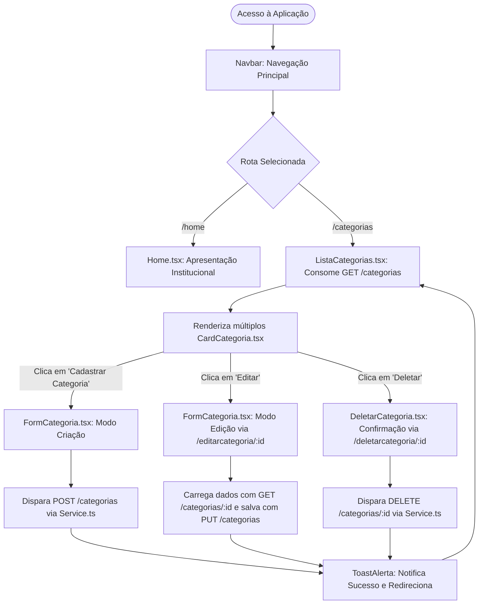
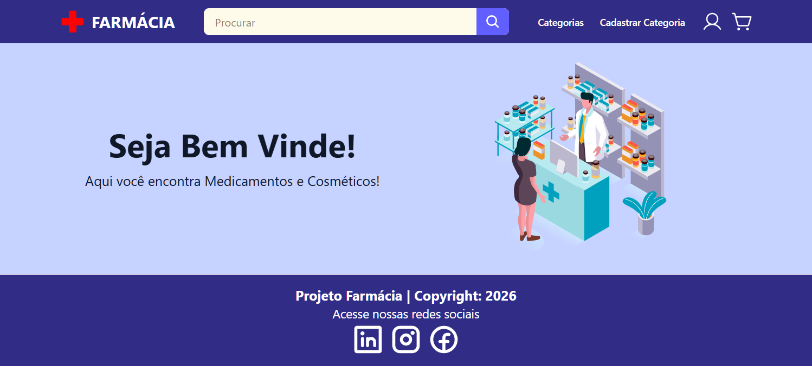

# 💊 Sistema de Gerenciamento de Farmácia (Front-end)

<br />

<div align="center">

[](https://react.dev/)
[](https://www.typescriptlang.org/)
[](https://vitejs.dev/)
[](https://tailwindcss.com/)
[](https://axios-http.com/)
[](https://reactrouter.com/)
[](https://brazil.generation.org/)
[](LICENSE)
[](#)

</div>

---

## 📖 Detalhes do Projeto

Este é o front-end de um Sistema de Gerenciamento para Farmácias, desenvolvido para facilitar o controle de estoque, categorização de produtos e interações diárias. A aplicação oferece uma interface intuitiva e responsiva para que administradores possam gerenciar categorias de medicamentos e cosméticos, contando com feedback visual em tempo real e consumo de API RESTful.

O projeto foi construído como parte da formação técnica da **Generation Brasil** no Bloco 03, consolidando conceitos avançados de Single Page Application (SPA), componentização funcional, tipagem estática e integração contínua com serviços backend.

---

## 🚀 Tecnologias Utilizadas

- **React**: Biblioteca JavaScript para construção da interface de usuário.
- **TypeScript**: Adiciona tipagem estática ao código, garantindo mais segurança e menos bugs.
- **Vite**: Ferramenta de build super rápida e otimizada para o desenvolvimento moderno.
- **Tailwind CSS**: Framework de utilitários CSS para estilização ágil, moderna e responsiva.
- **Axios**: Cliente HTTP para realizar requisições e consumo da API RESTful.
- **Lucide React / Phosphor Icons**: Biblioteca de ícones vetoriais modernos.
- **React Toastify**: Sistema de alertas e notificações com feedback visual em tempo real.

---

## ⚙️ Guia de Configuração (Setup)

1. **Clone o repositório**:

   ```bash
   git clone https://github.com/erickystn/projeto_final_bloco_03.git
   cd projeto_final_bloco_03
   ```

2. **Instale as dependências**:

   ```bash
   npm install
   ```

3. **Configure as Variáveis de Ambiente**:
   Crie um arquivo chamado `.env` na raiz do projeto (mesmo nível do `package.json`) e adicione a URL da sua API:

   ```env
   VITE_API_URL=http://localhost:8080  # Substitua pela URL real do seu Back-end se estiver na nuvem
   ```

4. **Execute o projeto**:

   ```bash
   npm run dev
   ```

   Abra seu navegador e acesse, por padrão, `http://localhost:5173`.

---

## 📂 Estrutura do Projeto

```text
PROJETO_FINAL_BLOCO_03/
│
├── src/
│   ├── assets/            # Imagens, vetores e recursos visuais
│   ├── components/        # Componentes reutilizáveis (Navbar, Footer, Modais)
│   │   ├── categoria/     # Componentes específicos de Categoria (Card, Form, Lista)
│   │   ├── footer/
│   │   └── navbar/
│   ├── models/            # Interfaces e tipos do TypeScript (Categoria, Produto)
│   ├── pages/             # Páginas da aplicação (Home, etc.)
│   ├── services/          # Configuração do Axios e chamadas para a API (Service.ts)
│   ├── utils/             # Utilitários globais (ToastAlerta.ts)
│   ├── App.tsx            # Roteamento central e casca da aplicação
│   ├── index.css          # Configuração das diretivas do Tailwind CSS
│   └── main.tsx           # Ponto de entrada do React DOM
│
├── .env.example           # Exemplo de configuração de variáveis de ambiente
├── package.json           # Dependências e scripts do projeto
├── tailwind.config.js     # Configurações do Tailwind CSS
├── tsconfig.json          # Configuração do compilador TypeScript
└── vite.config.ts         # Configuração de build do Vite
```

### Mapeamento Detalhado de Componentes

```bash
src/
├── components/
│   ├── categoria/
│   │   ├── cardcategoria/CardCategoria.tsx    # Card visual com botões de Editar e Deletar
│   │   ├── deletarcategoria/DeletarCategoria.tsx # Tela modal de confirmação de exclusão
│   │   ├── formcategoria/FormCategoria.tsx    # Formulário reutilizável de cadastro e edição
│   │   └── listacategorias/ListaCategorias.tsx # Grid responsivo com listagem e loading
│   ├── footer/Footer.tsx                      # Rodapé institucional com links de redes
│   └── navbar/Navbar.tsx                      # Cabeçalho com logo, navegação e barra de busca
├── models/
│   ├── Categoria.ts                           # Interface TypeScript da Categoria
│   └── Produto.ts                             # Interface TypeScript do Produto
├── pages/
│   └── home/Home.tsx                          # Banner de boas-vindas e apresentação
├── services/
│   └── Service.ts                             # Funções buscar, cadastrar, atualizar e deletar via Axios
└── utils/
    └── ToastAlerta.ts                         # ToastContainer e notificações temáticas
```

---

## 🔌 Funcionalidades e Rotas (App.tsx)

- `/home`: Página inicial com layout acolhedor e ilustrações customizadas.
- `/categorias`: Renderiza o componente `ListaCategorias` com todos os itens cadastrados no banco.
- `/cadastrarcategoria`: Acesso ao `FormCategoria` para criação de novos registros.
- `/editarcategoria/:id`: Reaproveitamento do `FormCategoria` para atualização de dados específicos.
- `/deletarcategoria/:id`: Interface de confirmação (`DeletarCategoria`) antes de excluir um registro.

---

## 📡 Integração com a API Backend (Endpoints Consumidos)

As operações do módulo de categorias consom a API REST configurada no serviço `src/services/Service.ts`:

| Operação | Método HTTP | Rota da API | Componente Solicitante | Descrição |
| :--- | :---: | :--- | :--- | :--- |
| **Listar Categorias** | `GET` | `/categorias` | `ListaCategorias.tsx` | Recupera todas as categorias para renderização em grid. |
| **Buscar Categoria por ID** | `GET` | `/categorias/:id` | `FormCategoria.tsx` / `DeletarCategoria.tsx` | Carrega os dados da categoria para pré-preenchimento ou confirmação. |
| **Cadastrar Categoria** | `POST` | `/categorias` | `FormCategoria.tsx` | Envia o objeto da nova categoria e exibe notificação de sucesso. |
| **Atualizar Categoria** | `PUT` | `/categorias` | `FormCategoria.tsx` | Atualiza o registro existente com os novos dados informados. |
| **Excluir Categoria** | `DELETE` | `/categorias/:id` | `DeletarCategoria.tsx` | Remove permanentemente o registro e atualiza a lista. |

---

## 📊 Modelagem de Dados (TypeScript Interfaces)

### Interface `Categoria` (`src/models/Categoria.ts`)
```typescript
import Produto from "./Produto";

export default interface Categoria {
  id: number;
  descricao: string;
  produto?: Produto | null;
}
```

### Interface `Produto` (`src/models/Produto.ts`)
```typescript
import Categoria from "./Categoria";

export default interface Produto {
  id: number;
  nome: string;
  descricao: string;
  quantidade: number;
  preco: number;
  foto: string;
  categoria?: Categoria | null;
}
```

---

## 🔄 Fluxo de Navegação e Operações CRUD



---

## 📸 Screenshots

<details open>
  <summary><strong>🖥️ Visualização da Interface da Aplicação</strong></summary>

  <br />

  <div align="center">
    
  </div>

</details>

---

## 📈 Próximos Passos e Melhorias (Roadmap)

- [ ] **Módulo Completo de Produtos:** Implementar os componentes de listagem, cadastro e edição de produtos farmacêuticos (`Produto.ts`).
- [ ] **Filtro de Busca em Tempo Real:** Conectar o input de pesquisa da `Navbar` para filtrar categorias dinamicamente pelo nome.
- [ ] **Paginação e Ordenação:** Adicionar suporte à paginação de registros para bases com grande volume de categorias.
- [ ] **Modo Escuro (Dark Mode):** Suporte à alternância de tema no Tailwind CSS.

---

## 🤝 Diretrizes de Contribuição

1. **Faça um Fork do repositório**
2. **Clone o seu fork**: `git clone https://github.com/seu-usuario/projeto_final_bloco_03.git`
3. **Crie uma branch**: `git checkout -b feature/sua-nova-feature`
4. **Faça o commit das alterações**: `git commit -m 'feat: adiciona filtro na listagem de categorias'`
5. **Faça o push para a sua branch**: `git push origin feature/sua-nova-feature`
6. **Abra um Pull Request** com uma descrição detalhada do que foi modificado

---

## 👤 Autor & Créditos

* **Desenvolvedor:** [Ericky Sant'ana](https://github.com/erickystn)
* **Formação:** Projeto prático desenvolvido como marco avaliativo do Bloco 03 no Bootcamp da [Generation Brasil](https://brazil.generation.org/).

---

## 📄 Licença

Este projeto está sob a licença **MIT**. Consulte o arquivo de licença ou utilize livremente o código para fins educacionais e de estudo.
